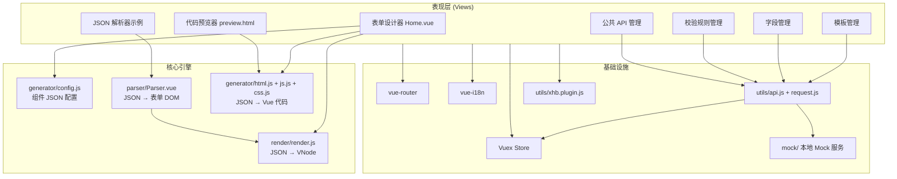

# Form Generator 项目技术文档

> 基于 [JakHuang/form-generator](https://github.com/JakHuang/form-generator) 二次开发的 Element UI 表单设计与代码生成器。  
> 当前版本：`0.2.0` | 项目名：`form-generator`

---

## 1. 项目简介

本项目是一套 **可视化表单设计器 + Vue 代码生成器 + JSON 表单解析器** 的完整解决方案，主要面向 Growatt/OSS 业务场景（表单模板管理等）。

核心能力：

- **拖拽设计**：在画布上拖拽 Element UI 组件，配置属性后实时预览
- **代码导出**：生成可直接运行的 `.vue` 单文件组件代码
- **JSON 导出/导入**：表单结构以 JSON 持久化，配合解析器动态渲染
- **后台管理**：模板、字段、校验规则、公共 API 的 CRUD 管理
- **国际化**：支持 8 种语言，Element UI 与业务文案同步切换

---

## 2. 技术栈

### 2.1 核心框架

| 类别 | 技术 | 版本 | 说明 |
|------|------|------|------|
| 前端框架 | Vue | 2.6.x | Options API |
| 路由 | vue-router | 3.x | Hash 模式 |
| 状态管理 | Vuex | 3.6.x | 全局字典、国际化、模板状态 |
| UI 组件库 | Element UI | 2.15.x | 表单组件来源 |
| 国际化 | vue-i18n | 8.x | 8 种语言 |
| 拖拽 | vuedraggable | 2.23.x | 设计器左/中面板拖拽 |
| HTTP | axios | 0.19.x | 接口请求 |
| 构建工具 | @vue/cli-service | 4.4.x | 多页面构建、代理、Mock |

### 2.2 工具库

| 库 | 用途 |
|----|------|
| `@babel/parser` | 代码解析（代码生成相关） |
| `clipboard` | 复制生成的 Vue 代码 |
| `file-saver` | 导出 `.vue` 文件 |
| `js-cookie` | 语言偏好持久化 |
| `mockjs` | 开发/生产 Mock 数据 |
| `throttle-debounce` | 防抖节流 |
| `xlsx` | Excel 导入导出（devDependencies） |
| `svg-sprite-loader` | SVG 图标雪碧图 |

### 2.3 开发与构建

| 工具 | 说明 |
|------|------|
| ESLint + Airbnb Base | 代码规范 |
| Sass | 样式预处理 |
| Babel | ES 转译 |
| element-theme / element-themex | Element UI 主题定制 |
| GitHub Actions | master 分支自动构建部署 gh-pages |

### 2.4 环境要求

- Node.js 10+
- 主题编译建议 Node 14（`element-theme` 工具链）

---

## 3. 系统架构

### 3.1 整体架构图



### 3.2 多页面入口

`vue.config.js` 配置了两个独立入口：

| 页面 | 入口文件 | HTML 模板 | 用途 |
|------|----------|-----------|------|
| `index.html` | `src/views/index/main.js` | `public/index.html` | 主应用（设计器 + 管理后台） |
| `preview.html` | `src/views/preview/main.js` | `public/preview.html` | 独立代码预览 iframe |

生产环境 `publicPath` 为 `/dist/`，开发环境为 `/`，开发服务器端口 **80**。

### 3.3 环境标识

通过全局变量 `window.OSSFormDesigner` 区分环境：

- `'development'`：开发模式，使用 `requestLocal` / `requestMock`，保留 console
- 其他：生产模式，使用 `request3`，禁用 console

### 3.4 数据流（表单设计器）

```
左面板组件库 (config.js)
    ↓ clone / 点击添加
中间画布 (DraggableItem + render.js 实时渲染)
    ↓ 选中组件
右侧属性面板 (RightPanel.vue)
    ↓ 配置 __config__ / __slot__ / __vModel__
导出路径：
  ├── JSON (JsonDrawer)
  ├── Vue 代码 (html.js + js.js + css.js)
  └── 预览 (postMessage → preview.html)
```

### 3.5 组件 JSON 协议

每个可拖拽组件遵循统一结构：

```javascript
{
  __config__: {        // 设计器元数据（非 Element 原生属性）
    label, tag, tagIcon, layout, span, typeCode,
    regList, fieldDescription, showByPrependField, ...
  },
  __slot__: { ... },    // 插槽内容（options、prepend 等）
  __vModel__: 'field',  // 绑定字段名（关联字段管理表）
  // 其余为 Element UI 组件原生 props
}
```

**自定义属性约定**：`__config__`、`__slot__`、`__vModel__`、`__diyComponentsName__` 均为项目扩展字段。

**typeCode 分段规则**：

| 范围 | 分类 |
|------|------|
| 0 ~ 99 | 输入型组件 (`inputComponents`) |
| 100 ~ 199 | 选择型组件 (`selectComponents`) |
| 200 ~ 299 | 布局型组件 (`layoutComponents`) |

---

## 4. 路由与功能页面

### 4.1 路由总览

| 路径 | 名称 | 组件 | 功能 |
|------|------|------|------|
| `/formDesignerIndex` | indexPage | `views/index/index.vue` | 管理后台布局壳（Header + Nav + 子路由） |
| `/formDesignerIndex/template` | template | `views/template/index.vue` | 表单模板管理 |
| `/formDesignerIndex/regular` | regular | `views/regular/index.vue` | 校验规则管理 |
| `/formDesignerIndex/field` | field | `views/field/index.vue` | 字段管理后台 |
| `/formDesignerIndex/commonAPI` | commonAPI | `views/commonAPI/index.vue` | 公共查询接口管理 |
| `/formDesignerHome` | home | `views/index/Home.vue` | **表单设计器主界面** |
| `/parser` | parser | `components/parser/example/Index.vue` | JSON 解析器示例 1 |
| `/parser2` | parser2 | `components/parser/example/Index2.vue` | JSON 解析器示例 2 |
| `/tinymce` | tinymce | `components/tinymce/example/Index.vue` | 富文本编辑器示例 |
| `*` | — | redirect → `/formDesignerIndex` | 默认重定向 |

路由定义：`src/router/index.js`  
子路由数据：`src/utils/routerData.js`

### 4.2 页面功能详述

#### 4.2.1 表单设计器 (`/formDesignerHome`)

**文件**：`src/views/index/Home.vue`

三栏布局：

- **左面板**：组件库（输入型 / 选择型 / 布局型），支持拖拽克隆到画布
- **中面板**：表单画布，基于 `DraggableItem.vue` + `vuedraggable` 嵌套布局
- **右面板**：`RightPanel.vue`，组件属性 + 表单全局属性

顶部操作栏：返回首页、运行、查看 JSON、导出 Vue、复制代码、清空、预览。

#### 4.2.2 模板管理 (`/formDesignerIndex/template`)

- 按产品、模板名称、适用国家筛选
- 模板 CRUD：新建、编辑、删除、进入设计器
- 使用 `xhb-country-select` 国家多选组件
- 模板数据与表单 JSON 关联存储

#### 4.2.3 字段管理 (`/formDesignerIndex/field`)

- 管理数据库表字段与别名映射
- 设计器右侧面板「字段选择」下拉数据来源（Vuex `fieldList`）
- 支持按表名、字段名、别名查询

#### 4.2.4 校验规则管理 (`/formDesignerIndex/regular`)

- 管理正则表达式 / 校验方法
- 设计器组件 `regList` 校验规则来源（Vuex `regList`）
- 应用启动时 `main.js` 预加载全量规则列表

#### 4.2.5 公共 API 管理 (`/formDesignerIndex/commonAPI`)

- 管理下拉/级联等组件的服务端数据源接口
- 组件 `dataSources: '2'` 时从公共 API 拉取选项

#### 4.2.6 JSON 解析器 (`/parser`, `/parser2`)

- 将存储的 JSON 表单配置渲染为真实可交互表单
- 核心：`src/components/parser/Parser.vue`
- 可独立打包为 npm 包 `form-gen-parser`

#### 4.2.7 代码预览器 (`preview.html`)

- 通过 `postMessage` 接收设计器生成的 html/js/css
- 动态创建 Vue 实例实时预览（无需重新构建）

---

## 5. 模块结构

```
form-generator-dev/
├── public/                      # 静态资源与 HTML 模板
│   ├── index.html
│   └── preview.html
├── mock/                        # 开发 Mock 服务
│   ├── index.js                 # chokidar 热更新 Mock 路由
│   └── controller/              # 各业务 Mock 接口
│       ├── template.js
│       ├── field.js
│       ├── regular.js
│       └── commonAPI.js
├── src/
│   ├── views/
│   │   ├── index/               # 设计器主模块
│   │   │   ├── main.js          # 应用入口
│   │   │   ├── App.vue
│   │   │   ├── index.vue        # 管理后台布局
│   │   │   ├── Home.vue         # 设计器三栏主界面
│   │   │   ├── DraggableItem.vue# 画布拖拽项渲染
│   │   │   ├── RightPanel.vue   # 右侧属性配置面板
│   │   │   └── JsonDrawer.vue   # JSON 查看抽屉
│   │   ├── preview/main.js      # 预览页入口
│   │   ├── template/index.vue   # 模板管理
│   │   ├── field/index.vue      # 字段管理
│   │   ├── regular/index.vue    # 规则管理
│   │   └── commonAPI/index.vue  # 公共 API 管理
│   ├── components/
│   │   ├── generator/           # ★ 代码生成引擎
│   │   │   ├── config.js        # 组件库 JSON 配置（核心）
│   │   │   ├── drawingDefalut.js# 默认画布数据
│   │   │   ├── html.js          # 生成 <template>
│   │   │   ├── js.js            # 生成 <script>
│   │   │   ├── css.js           # 生成 <style>
│   │   │   └── ruleTrigger.js   # 校验触发方式映射
│   │   ├── render/              # ★ JSON 运行时渲染器
│   │   │   ├── render.js        # conf → VNode
│   │   │   ├── slots/           # 各组件插槽渲染函数
│   │   │   └── lib/               # 打包产物 form-gen-render
│   │   ├── parser/              # ★ JSON 表单解析器
│   │   │   ├── Parser.vue
│   │   │   ├── index.js
│   │   │   ├── example/         # 使用示例
│   │   │   └── lib/             # 打包产物 form-gen-parser
│   │   ├── tinymce/             # 富文本组件封装
│   │   ├── xhb/                 # 业务自定义组件
│   │   │   └── xhb-country-select.vue
│   │   ├── SvgIcon/             # SVG 图标组件
│   │   ├── diyHeader.vue        # 管理后台顶栏
│   │   ├── diyNav.vue           # 管理后台侧栏导航
│   │   └── language.vue         # 语言切换
│   ├── router/index.js
│   ├── store/store.js           # Vuex 全局状态
│   ├── i18n/                    # 国际化语言包
│   ├── config/                  # 项目配置
│   │   ├── index.js
│   │   ├── setting.config.js
│   │   ├── theme.config.js
│   │   └── net.config.js
│   ├── utils/
│   │   ├── api.js               # 业务 API 定义
│   │   ├── request.js           # axios 封装（多代理实例）
│   │   ├── xhb.plugin.js        # 业务工具插件 ($xhb)
│   │   ├── common.js            # 通用工具
│   │   ├── db.js                # localStorage 持久化
│   │   ├── index.js             # 深拷贝、字段联动等
│   │   └── OSSWorldData.js      # 国家地区数据
│   ├── styles/                  # 全局样式
│   ├── icons/                   # SVG 图标资源
│   └── oss-theme/               # 自定义 OSS 主题 CSS
├── dark-theme/                  # 暗色主题（element-theme 导出）
├── dark-theme-2/
├── element-variables.scss       # Element 主题变量源文件
├── vue.config.js
└── package.json
```

---

## 6. 核心模块详解

### 6.1 组件配置 (`generator/config.js`)

定义三类组件库及表单全局配置 `formConf`：

**输入型组件 (typeCode 0~99)**：

| typeCode | 组件 | Element Tag |
|----------|------|-------------|
| 1 | 输入框 | el-input |
| 2 | 多输入框组件（组串） | el-row + 多个 el-input |
| 3 | 文本域 | el-input (textarea) |
| 4 | 是否选择 | el-radio-group |
| 5 | 时间选择器 | el-time-picker |
| 6 | 日期选择器 | el-date-picker |
| 7 | 下拉选择 | el-select |
| 8 | 只读输入框（只读） | el-input (readonly) |
| 9 | 附件上传 | el-upload |
| 10 | 纯文本 | el-link (自定义 diy-text) |

**选择型组件 (typeCode 100~199)**：密码、计数器、富文本编辑器、级联选择、单选框组、复选框组、开关、滑块、时间选择/范围、日期选择/范围、评分、颜色选择、上传等。

**布局型组件 (typeCode 200~299)**：行容器、按钮、表格（开发中）等。

### 6.2 运行时渲染器 (`render/render.js`)

- 读取组件 `conf` JSON，通过 JSX 渲染函数生成 VNode
- `slots/` 目录按 `__config__.tag` 映射插槽渲染逻辑
- 支持 `vModel` 双向绑定、`diy` 自定义事件
- 可独立打包：`npm run build:render` → `form-gen-render`

### 6.3 表单解析器 (`parser/Parser.vue`)

- 接收 `formConf` + `fields` JSON，递归渲染 `colFormItem` / `rowFormItem` 布局
- 自动构建 `rules` 校验规则（含 `regList`、必填）
- 支持 `showByPrependField` 前置字段联动显示
- 可独立打包：`npm run build:parser` → `form-gen-parser`

### 6.4 代码生成器 (`generator/html.js` / `js.js` / `css.js`)

| 文件 | 输出 |
|------|------|
| `html.js` | Vue `<template>` 字符串 |
| `js.js` | Vue `<script>` 字符串（data、methods、rules） |
| `css.js` | `<style>` 字符串 |

支持 dialog 包裹模式、表单按钮、栅格布局等。

### 6.5 拖拽画布 (`DraggableItem.vue`)

- 根据 `__config__.layout` 分发到 `colFormItem` 或 `rowFormItem` 布局
- 集成复制/删除工具按钮
- 处理 `typeCode: 2` 组串类组件的选中态与样式

### 6.6 属性面板 (`RightPanel.vue`)

按 `typeCode` 条件渲染不同配置项：

- 字段选择（关联 `fieldList`）
- 显示名称、默认值、字段说明
- 前置字段联动 (`showByPrependField`)
- 校验规则 (`regList`)
- 数据来源 (`dataSources`: 自行录入 / 服务端)
- 组件特有属性（上传限制、日期范围等）

---

## 7. 状态管理 (Vuex)

**文件**：`src/store/store.js`

| State | 说明 |
|-------|------|
| `i18nLocal` / `i18nOption` | 当前语言与文案 |
| `languageConfig` | 语言 code 映射 |
| `regList` | 校验规则字典（启动时加载） |
| `fieldList` | 字段字典（启动时加载） |
| `currTempInfo` | 当前编辑的模板信息 |
| `countryList` / `cityList` | 国家城市数据 |

关键 Mutations：`updateRegList`、`updateFieldList`、`setCurrTempInfo`、`setLangOption`

---

## 8. API 与网络层

### 8.1 请求实例

`src/utils/request.js` 提供多个 axios 实例：

| 实例 | 代理前缀 | 用途 |
|------|----------|------|
| `requestLocal` | `/local` | 本地 JSON 文件服务 |
| `requestRoot` | `/root` | 根路径本地服务 |
| `request3` | 生产第三方 API | 生产环境 |
| `requestMock` | Mock 服务 | 开发 Mock（mockjs） |
| `requestSelf` | `/api` | 测试 API |

### 8.2 业务 API (`utils/api.js`)

| 模块 | 接口前缀 | 主要方法 |
|------|----------|----------|
| 校验规则 | `regular/` | allList, list, add, update, del |
| 字段 | `field/` | allList, list, databaseTableList, add, update, del |
| 模板 | `template/` | list, add, update, del |
| 公共 API | `commonAPI/` | allList, list, add, update, del |
| 公共 | `common/` | country, city |

### 8.3 Mock 服务

- 开发环境：`vue.config.js` → `devServer.after` 挂载 `mock/index.js`
- 生产环境：`main.js` 中 `mockXHR()` 拦截
- Mock 文件变更时 `chokidar` 热重载路由

---

## 9. 国际化

**配置**：`src/i18n/index.js`

支持语言：`cn` / `zh-CN` / `zh-TW` / `en-US` / `it` / `pl` / `pt` / `de` / `cs-CZ`

Element UI 组件文案与业务 `src/i18n/*.js` 语言包合并。语言偏好通过 `js-cookie` 持久化。

---

## 10. 主题定制

| 目录/文件 | 说明 |
|-----------|------|
| `element-variables.scss` | Element UI SCSS 变量源 |
| `oss-theme/` | 当前使用的 OSS 定制主题 CSS |
| `dark-theme/` / `dark-theme-2/` | 暗色主题导出产物 |
| `src/views/index/main.js` | 引入 `@/oss-theme/index.css` |

主题编译命令（需 Node 14）：

```bash
nvm use 14.18.1
et -o ./dark-theme
```

---

## 11. 可独立发布的子包

| 包名 | 构建命令 | 入口 | 说明 |
|------|----------|------|------|
| form-gen-render | `npm run build:render` | `render/render.js` | JSON → VNode 渲染器 |
| form-gen-parser | `npm run build:parser` | `parser/index.js` | JSON → 表单组件 |
| form-gen-tinymce | `npm run build:tinymce` | `tinymce/index.js` | 富文本封装 |

产物分别输出到各模块 `lib/` 目录。

---

## 12. 配套插件与生态

| 名称 | 说明 | 链接 |
|------|------|------|
| form-generator-plugin | VSCode 右键打开设计器，代码直接保存到工程 | [GitHub](https://github.com/JakHuang/form-generator-plugin) |
| form-gen-parser (npm) | JSON 解析器 npm 包 | `npm i form-gen-parser` |
| JSON 参数对照表 | 组件 JSON 字段说明 | [Issue #46](https://github.com/JakHuang/form-generator/issues/46) |

---

## 13. 常用 npm 脚本

```bash
npm run dev              # 启动开发服务器（端口 80）
npm run build            # 生产构建
npm run build:report     # 构建并生成包分析报告
npm run build:render     # 打包 render 子库
npm run build:parser     # 打包 parser 子库
npm run build:tinymce    # 打包 tinymce 子库
npm run lint             # ESLint 检查并自动修复
```

---

## 14. 扩展开发指南

### 14.1 新增表单组件

1. 在 `src/components/generator/config.js` 对应数组中添加组件 JSON 配置
2. 若组件有插槽，在 `src/components/render/slots/` 添加 `{tag}.js`
3. 在 `RightPanel.vue` 中补充该 `typeCode` 的属性编辑表单项
4. 在 `generator/html.js` / `js.js` 中补充代码生成逻辑（如需导出）
5. 在 `parser/Parser.vue` 确认 `ruleTrigger` 映射（如需校验）

### 14.2 新增管理页面

1. 在 `src/views/` 下创建页面组件
2. 在 `src/utils/routerData.js` 注册子路由
3. 在 `src/utils/api.js` 添加接口
4. 在 `mock/controller/` 添加 Mock 数据（开发用）

### 14.3 关键约定

- 自定义元数据统一放在 `__config__` / `__slot__` 中，渲染前会被剥离
- 字段绑定使用 `__vModel__`，值来自 Vuex `fieldList`
- 组件联动使用 `showByPrependField` 前置字段机制
- 业务工具优先使用 `this.$xhb`（`xhb.plugin.js`）已有方法

---

## 15. CI/CD

`.github/workflows/ci.yml`：push 到 `master` 时自动 `npm install` + `npm run build`，部署 `dist/` 到 `gh-pages` 分支。

---

*文档生成日期：2026-06-26*
